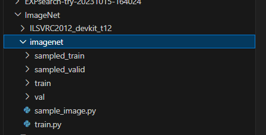

## requirement

```python
torch =2.0.0
torchvision  =  0.15.1
nni  =  2.10.1
numpy  = 1.24.3
python  =3.9.16
```

## dataset



具体来说，将imagenet2012数据集，放在./ImageNet/imagenet中，其中训练集放在./ImageNet/imagenet/train，验证集放在./ImageNet/imagenet/val。


## architecture

```python
# 在cifar10上的评估acc分别是97.54%,97.53%
bb1 = Genotype(normal=[('skip_connect', 1), ('sep_conv_5x5', 0), ('sep_conv_3x3', 0), ('sep_conv_3x3', 1), ('skip_connect', 1), ('sep_conv_3x3', 1), ('sep_conv_3x3', 2), ('max_pool_3x3', 0)], normal_concat=range(2, 6), reduce=[('sep_conv_3x3', 0), ('max_pool_3x3', 0), ('max_pool_3x3', 1), ('sep_conv_3x3', 0), ('sep_conv_3x3', 1), ('sep_conv_5x5', 0), ('max_pool_3x3', 1), ('sep_conv_5x5', 0)], reduce_concat=range(2, 6))


bb2 = Genotype(normal=[('dil_conv_3x3', 0), ('sep_conv_3x3', 0), ('sep_conv_3x3', 0), ('sep_conv_3x3', 1), ('skip_connect', 0), ('sep_conv_5x5', 1), ('sep_conv_3x3', 4), ('max_pool_3x3', 1)], normal_concat=range(2, 6), reduce=[('sep_conv_3x3', 0), ('max_pool_3x3', 0), ('max_pool_3x3', 1), ('sep_conv_3x3', 0), ('sep_conv_5x5', 0), ('sep_conv_5x5', 1), ('max_pool_3x3', 1), ('sep_conv_5x5', 0)], reduce_concat=range(2, 6))
```


## Evaluate

```python
# 在Evaluate_imagenet目录下执行该命令
python train_imagenet.py --arch 5

# arch表示需要评估架构对应的编号，这里总共有PCdarts = ['bb1','bb2','bb3_imagenet',
'bb4_IM_acc76','bb5_IM_acc75','bb6_imagenet_f','bb7_imagenet_f']
```


## 备注

- architecture 已经放在 genotypes.py 中
- search_space.json表示nni对应的搜索空间，其中表示bb1和bb2对应的下表
- config.yml表示nni对应的配置文件
- 评估的主函数为train_imagenet.py
  - 其中可以调节batchsize等超参

